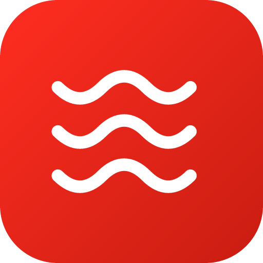
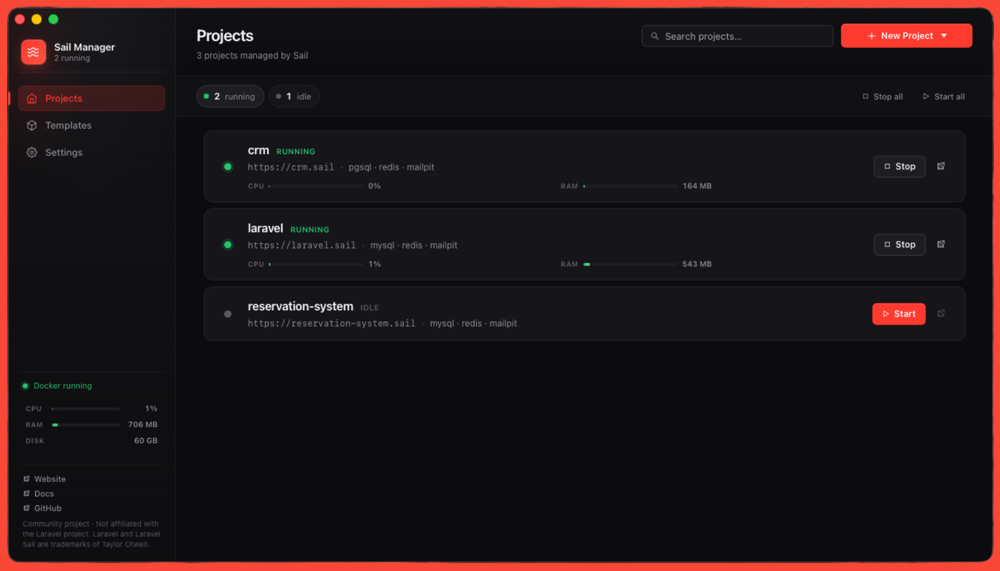

<p align="center">
  
</p>

<h1 align="center">Sail Manager</h1>

<p align="center">
  <b>The Laravel Sail GUI for macOS. Run every project at once.</b>
</p>

<p align="center">
  <a href="https://github.com/LuukDahlmans/Laravel-Sail-Manager/releases/latest"><b>Download for macOS →</b></a>
  &nbsp;·&nbsp;
  <a href="https://sailmanager.app">Website</a>
  &nbsp;·&nbsp;
  <a href="https://sailmanager.app/docs">Docs</a>
  &nbsp;·&nbsp;
  <a href="https://sailmanager.app/docs/quick-start">Quick start</a>
</p>

<p align="center">
  
  
  
  
</p>

<p align="center">
  
</p>

## Stop fighting Sail. Start shipping.

Laravel Sail is great until you open a second project. That's when it falls apart. Both projects fight over host port 80. Both want MySQL on 3306. Vite collides on 5173. You start one, stop the other, repeat ten times a day.

Sail Manager fixes it. Every project gets its own host ports automatically, written into its `.env` so Sail's stock compose file picks them up. They all run at once. Every project gets a real URL like `https://myapp.sail` with a green padlock. No editing `compose.yaml`. No mkcert. No Valet.

<p align="center">
  <a href="https://github.com/LuukDahlmans/Laravel-Sail-Manager/releases/latest"><b>Download for macOS</b></a><br>
  <sub>Free. MIT licensed. Apple Silicon + Intel. ~30 MB DMG.</sub>
</p>

## What you get

### Every Sail project, running at the same time

The killer feature, and it's automatic. Sail Manager probes for free host ports (correctly, on macOS — see the [How it works](#how-it-works) section), allocates a unique range per project, and writes the values into `.env`: `APP_PORT`, `FORWARD_DB_PORT`, `FORWARD_REDIS_PORT`, `VITE_PORT`, the lot. No more `Bind for 0.0.0.0:80 failed: port is already allocated`. Five client projects, one click, all green.

### Real URLs with real HTTPS

Visit `https://myapp.sail` instead of `localhost:54321`. Browsers show a green padlock. Sail Manager handles every piece: a Traefik proxy on `:80` and `:443`, a `dnsmasq` resolver on port 5354 (so it coexists with Herd or Valet), and a local Certificate Authority that's trusted in your login keychain. One admin prompt the first time you turn it on. Never again. The cert auto-regenerates when you add or remove a project.

### Create, clone, or import in a click

- **Create new** runs `laravel new` and Sail install entirely in Docker. No local PHP needed. Auto-starts the project once scaffolded.
- **Clone from Git** clones a repo and installs Sail if it's missing.
- **Import existing** parses any folder's `.env` and compose file, registers it, and reallocates ports if they conflict.

### 13 services, one checkbox each

mysql · pgsql · mariadb · redis · valkey · memcached · mailpit · meilisearch · typesense · mongodb · minio · selenium · soketi

Plus a free-form custom-services field for anything Sail supports that the UI doesn't surface yet. Each project gets only the services it ticks; nothing shared, nothing leaking between projects.

### Auto-commands for the long-running stuff

Horizon, queue workers, scheduler, Reverb, Pail, Pulse, Vite dev — anything you'd normally keep running in a separate terminal. Service-mode runs detached and lives until containers stop. Once-mode runs blocking on every start (extra migrations, `storage:link`, `npm install`). Curated preset library so you don't have to remember the command.

After every successful start, Sail Manager waits for container healthchecks via `docker compose up -d --wait`, then runs `php artisan migrate --force` automatically. Laravel 11+ uses the database session driver, so missing tables means a 500 on every page. You shouldn't have to remember that.

### Native macOS, not a webpage in a window

- **Menu-bar tray** with per-project submenu. Open URL, start, stop, reveal in Finder, jump to detail.
- **Light, dark, and system theme** synced with macOS native window appearance, including the traffic-light buttons.
- **Cmd+K command palette** for everything.
- **Live Docker status** in the sidebar with a one-click *Start Docker* button when the daemon is paused or quit.
- Native folder picker. Native confirmation dialogs.

### Live observability per project

- `docker compose logs -f` streaming in the Logs tab with per-service filtering.
- CPU, RAM, and network usage per container in the Resource panel.
- Project history of every lifecycle event with timestamps.
- Git status on each project card: branch, dirty/clean, ahead/behind.
- Auto-command output in tabbed live streams.

### Quick-open everywhere

Each project has one-click buttons for: browser, Mailpit, TablePlus (with copyable DSN), Terminal, Finder, and your configured editor — PhpStorm, VS Code, Cursor, or Zed.

### Project Templates

Define your typical service combinations once and apply them on create. Three templates seeded out of the box. Full CRUD if you want to add your own.

### What you don't need installed

- No local PHP, Composer, or Node.
- No MySQL, Redis, or Postgres on the host.
- No mkcert.
- No `/etc/hosts` edits.
- No edits to `compose.yaml` or `docker-compose.yml` (so Sail upgrades stay clean).

The only thing on your host is Sail Manager and Docker Desktop.

## Install

<p align="center">
  <a href="https://github.com/LuukDahlmans/Laravel-Sail-Manager/releases/latest"><b>Download the latest DMG →</b></a>
</p>

Unsigned for now (Apple Developer enrollment in progress), so first-launch is right-click → Open. After that it's a normal app and updates auto-install on subsequent launches.

Or build from source:

```sh
git clone https://github.com/LuukDahlmans/Laravel-Sail-Manager
cd Laravel-Sail-Manager
npm install
npm run tauri build
```

Output lands in `src-tauri/target/release/bundle/macos/`.

## Compared to the alternatives

|  | **Sail Manager** | Valet | Herd | Stock Sail |
|---|---|---|---|---|
| Multiple projects in parallel | **Yes, automatic** | Yes | Yes | No (port collisions) |
| `.test` / `.sail` URLs | **Yes** | Yes | Yes | No |
| HTTPS for local URLs | **Yes, automatic** | Manual (mkcert) | Yes | No |
| GUI | **Yes** | No | Yes | No |
| Docker isolation per project | **Yes** | No | Add-ons | Yes |
| Per-project services (DB, Redis, queue, mail) | **Yes, isolated** | Manual | Add-ons | Compose-file edits |
| Per-project PHP version | **Yes (via Sail)** | Yes | Yes | Yes |
| No local PHP install | **Yes** | No | No | Yes |
| Free + open source | **Yes (MIT)** | Yes | Free tier | Yes |

Use Sail Manager when you want production-parity Docker per project *and* the Valet/Herd convenience. If your projects all share one PHP version, one MySQL, and don't need any isolation, Herd is probably enough.

## How it works

For the curious. Skip if you don't care.

### Port allocation that respects macOS reality

Picking a free port is harder than it looks. Docker for Mac binds the IPv6 wildcard (`[::]`) for published ports, so a `TcpListener::bind(127.0.0.1, port)` will say "free" while a stopped-but-not-removed container is still holding the port at the kernel level. Sail Manager probes both `0.0.0.0:port` AND `[::]:port`. If either bind fails, the port is taken.

Once a free port is found, the project's `.env` gets `APP_PORT`, `FORWARD_DB_PORT`, `FORWARD_REDIS_PORT`, `VITE_PORT`, and the rest. Sail's stock `compose.yaml` reads those keys directly, so we don't touch the compose file. `COMPOSE_PROJECT_NAME` gets set per project too, so each project ends up on its own Docker network.

### .sail URLs

Single Traefik container on host `:80` (plus `:443` if HTTPS is on). The file-provider config maps `Host(<name>.<tld>)` → `host.docker.internal:<APP_PORT>` for each running project. A `dnsmasq` container on `127.0.0.1:5354` resolves `*.<tld>` to `127.0.0.1`. macOS picks that up via one line at `/etc/resolver/<tld>`. One admin prompt total. Adding or removing projects after that is config-file rewrites only.

### HTTPS with a green padlock

The wrinkle: Chrome silently rejects `*.<single-label-tld>` wildcard certs as too broad. Sail Manager generates a local CA, issues a wildcard cert that includes explicit per-project SANs (`*.sail`, `sail`, `localhost`, `myapp.sail`, `another.sail`, ...), and trusts the CA in your login keychain via the `security` command. macOS prompts via the standard keychain dialog (no admin password). The cert auto-regenerates whenever the project list changes.

## FAQ

**Will this break Sail when I update it?**
No. Sail Manager never edits `compose.yaml` or `docker-compose.yml`. All customization lives in `.env`, which Sail's stock compose file reads. Run `composer update laravel/sail` and your changes follow.

**Can I use this with an existing Sail project?**
Yes. Use *Import existing*. Sail Manager parses the project's `.env`, validates its compose file, and registers it. If the project's ports collide with one you've already imported, it reallocates and rewrites the `.env` for you.

**Does it conflict with Herd or Valet?**
No. Sail Manager's `dnsmasq` runs on port 5354 (not 53) so it coexists with both. Pick a TLD other than `.test` if you also use Herd, to avoid `/etc/resolver` conflicts.

**Is there telemetry?**
None. No analytics, no crash reporting, no phone-home. The app makes exactly the network calls you'd expect: `docker pull`, `git clone`, and an optional update check against GitHub Releases.

**Why Tauri and not Electron?**
Bundle size and memory. The DMG is ~30 MB; the running app sits around ~120 MB RAM. Electron equivalents typically start at 200 MB DMG and 400 MB RAM. Native macOS conventions (traffic lights, menu bar, theme sync) are also more straightforward in Tauri.

**Can I run this on Linux or Windows?**
Not yet. Tauri supports both, but the macOS-specific bits (PATH augmentation, the `osascript` resolver writer, the menu-bar tray) need platform equivalents. Linux and Windows are on the roadmap.

**Can I contribute?**
Please. See [CONTRIBUTING.md](CONTRIBUTING.md). Linux/Windows ports, the database table browser, and the in-app container shell are the highest-impact open items.

## Requirements

macOS 12 or newer (Apple Silicon or Intel). Docker Desktop 4.30 or newer. That's it.

## Roadmap

- Code-signed and notarized release builds (Apple Developer Program enrollment in progress)
- Linux and Windows builds
- Database table browser tab to reduce trips to TablePlus
- Container shell as a tab via xterm.js plus a PTY-backed Tauri command
- Project-level `.env` editor in the UI
- Per-project HTTPS toggle (currently global)

## Tech stack

Tauri 2 + Rust backend. SvelteKit and Svelte 5 runes for the UI (SSR off, single-page). SQLite via `tauri-plugin-store` for state. 92 Rust unit tests over the high-value pure logic.

## License

MIT. See [LICENSE](LICENSE).

Community project. Not affiliated with Laravel; Laravel and Laravel Sail are trademarks of Taylor Otwell.

---

<p align="center">
  <a href="https://github.com/LuukDahlmans/Laravel-Sail-Manager/releases/latest"><b>Download Sail Manager →</b></a>
</p>

<p align="center">
  Built by <a href="https://github.com/luukdahlmans">Luuk Dahlmans</a>.
  If Sail Manager saves you time, <a href="https://github.com/LuukDahlmans/Laravel-Sail-Manager">a star</a> helps other Laravel devs find it.
</p>
